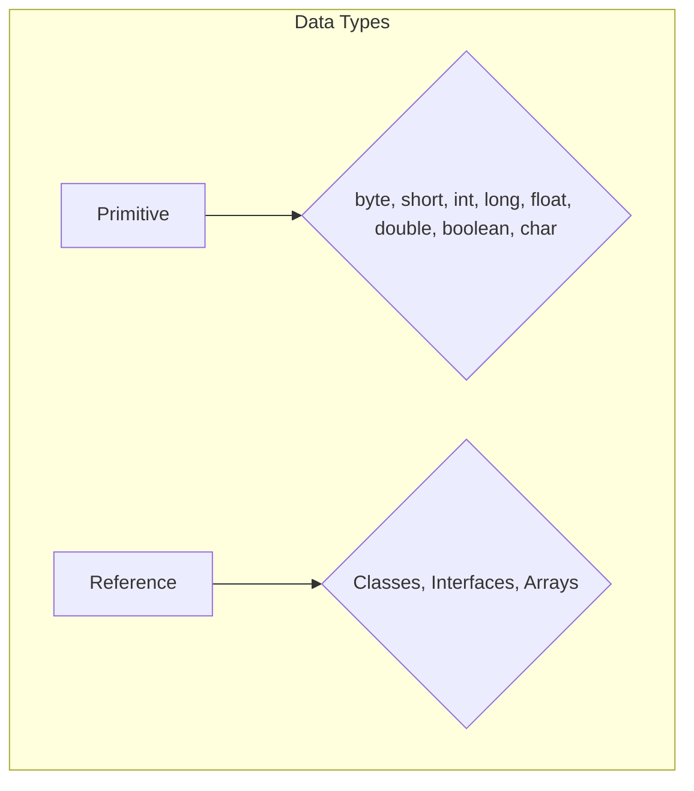

# Data Types in Java

An explanation of primitive and reference data types in Java.

## Goal
The goal of this section is to understand the different data types in Java, including the eight primitive types and the concept of reference types. We will also cover the memory allocation for each type.

## Explanation
In Java, data types are divided into two main categories:

1.  **Primitive Data Types:** The basic building blocks of data in Java. There are eight primitive types.
2.  **Reference Data Types:** Used to refer to objects. They are created using defined classes or interfaces.

### Primitive Data Types
Primitive types are predefined by the language and named by a keyword. The eight primitive types are:

*   **`byte`:** 1 byte, stores whole numbers from -128 to 127.
*   **`short`:** 2 bytes, stores whole numbers from -32,768 to 32,767.
*   **`int`:** 4 bytes, stores whole numbers from -2,147,483,648 to 2,147,483,647.
*   **`long`:** 8 bytes, stores whole numbers from -9,223,372,036,854,775,808 to 9,223,372,036,854,775,807.
*   **`float`:** 4 bytes, stores fractional numbers. Sufficient for storing 6 to 7 decimal digits.
*   **`double`:** 8 bytes, stores fractional numbers. Sufficient for storing 15 decimal digits.
*   **`boolean`:** 1 bit, stores `true` or `false` values.
*   **`char`:** 2 bytes, stores a single character/letter or ASCII values.

### Reference Data Types
Reference types, also known as non-primitive types, are used to refer to objects. Unlike primitive types, which store their values directly, reference types store the memory address of the object they refer to.

Examples of reference types include:

*   **Classes:** `String`, `Integer`, `Scanner`, etc.
*   **Interfaces:** `List`, `Map`, `Set`, etc.
*   **Arrays**

## Code
Here is an example that demonstrates the use of various data types in Java:

```java
public class DataTypesExample {
    public static void main(String[] args) {
        // Primitive types
        byte myByte = 100;
        short myShort = 5000;
        int myInt = 65000;
        long myLong = 15000000000L;
        float myFloat = 5.75f;
        double myDouble = 19.99d;
        boolean myBoolean = true;
        char myChar = 'A';

        // Reference type
        String myString = "Hello, Java!";

        System.out.println("byte: " + myByte);
        System.out.println("short: " + myShort);
        System.out.println("int: " + myInt);
        System.out.println("long: " + myLong);
        System.out.println("float: " + myFloat);
        System.out.println("double: " + myDouble);
        System.out.println("boolean: " + myBoolean);
        System.out.println("char: " + myChar);
        System.out.println("String: " + myString);
    }
}
```

## Diagrams


## Pitfalls
*   **Integer Overflow:** Assigning a value to a numeric type that is larger than its maximum value will cause an overflow, resulting in an incorrect value.
*   **Floating-Point Precision:** `float` and `double` types cannot represent all decimal numbers exactly, which can lead to precision errors in calculations.
*   **NullPointerException:** Attempting to use a reference variable that has not been initialized (i.e., it is `null`) will result in a `NullPointerException`.

## Exercises/Examples
1.  **Write a program that declares two integer variables, adds them together, and prints the result.**
    <details>
    <summary>Answer</summary>

    ```java
    public class AddTwoNumbers {
        public static void main(String[] args) {
            int num1 = 10;
            int num2 = 20;
            int sum = num1 + num2;
            System.out.println("The sum is: " + sum);
        }
    }
    ```
    </details>
2.  **What is the default value of the `boolean` data type?**
    <details>
    <summary>Answer</summary>
    The default value of the `boolean` data type is `false`.
    </details>
3.  **What is the difference between a primitive type and a reference type?**
    <details>
    <summary>Answer</summary>
    A primitive type stores the actual value, while a reference type stores the memory address of an object.
    </details>

## References
*   [Oracle Primitive Data Types](https://docs.oracle.com/javase/tutorial/java/nutsandbolts/datatypes.html)
*   [W3Schools Java Data Types](https://www.w3schools.com/java/java_data_types.asp)