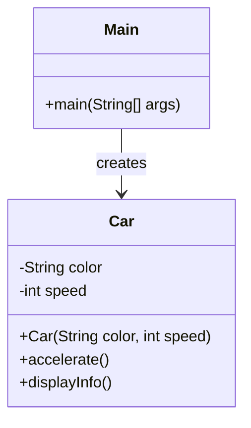

# Classes and Objects in Java

An introduction to the fundamental concepts of classes and objects in Java.

## Goal
The goal of this section is to understand what classes and objects are, how to create them, and how they form the foundation of object-oriented programming in Java.

## Explanation
In Java, everything is centered around **classes** and **objects**. A class is a blueprint or template from which objects are created. An object is an instance of a class.

### Classes
A class defines the structure and behavior of objects. It contains:
*   **Fields (Variables):** Store data or state of an object.
*   **Methods:** Define the behavior or actions that an object can perform.
*   **Constructors:** Special methods used to initialize objects when they are created.

### Objects
An object is a real-world entity that has state and behavior. For example, a `Car` class might define properties like `color` and `speed`, while a specific car object would have actual values like "red" and "60 mph".

### Creating Classes and Objects
To create a class, use the `class` keyword. To create an object from a class, use the `new` keyword.

## Code
Here is an example that demonstrates creating a class and objects in Java:

```java
// Define a class
public class Car {
    // Fields (variables)
    String color;
    int speed;

    // Constructor
    public Car(String color, int speed) {
        this.color = color;
        this.speed = speed;
    }

    // Method
    public void accelerate() {
        speed += 10;
        System.out.println("Car accelerated. Current speed: " + speed);
    }

    public void displayInfo() {
        System.out.println("Color: " + color + ", Speed: " + speed);
    }
}

// Main class to test
public class Main {
    public static void main(String[] args) {
        // Create objects
        Car myCar = new Car("Red", 50);
        Car anotherCar = new Car("Blue", 30);

        // Use object methods
        myCar.displayInfo();
        myCar.accelerate();

        anotherCar.displayInfo();
        anotherCar.accelerate();
    }
}
```

## Diagrams


## Pitfalls
*   **Forgetting the `new` Keyword:** Objects must be created with `new`. Simply declaring a variable doesn't create an object.
*   **NullPointerException:** Trying to use a method or field on a null reference will cause a `NullPointerException`.
*   **Confusing Class and Object:** A class is a template, while an object is an instance of that template.

## Exercises/Examples
1.  **Create a `Student` class with fields for name and age, and a method to display student information.**
    <details>
    <summary>Answer</summary>

    ```java
    public class Student {
        String name;
        int age;

        public Student(String name, int age) {
            this.name = name;
            this.age = age;
        }

        public void displayInfo() {
            System.out.println("Name: " + name + ", Age: " + age);
        }
    }
    ```
    </details>
2.  **What is the difference between a class and an object?**
    <details>
    <summary>Answer</summary>
    A class is a blueprint or template that defines the structure and behavior of objects. An object is an instance of a class with actual values.
    </details>
3.  **What is the purpose of the `this` keyword in the constructor?**
    <details>
    <summary>Answer</summary>
    The `this` keyword refers to the current object. It's used to distinguish between class fields and constructor parameters when they have the same name.
    </details>

## References
*   [Oracle Classes and Objects](https://docs.oracle.com/javase/tutorial/java/javaOO/index.html)
*   [W3Schools Java Classes](https://www.w3schools.com/java/java_classes.asp)