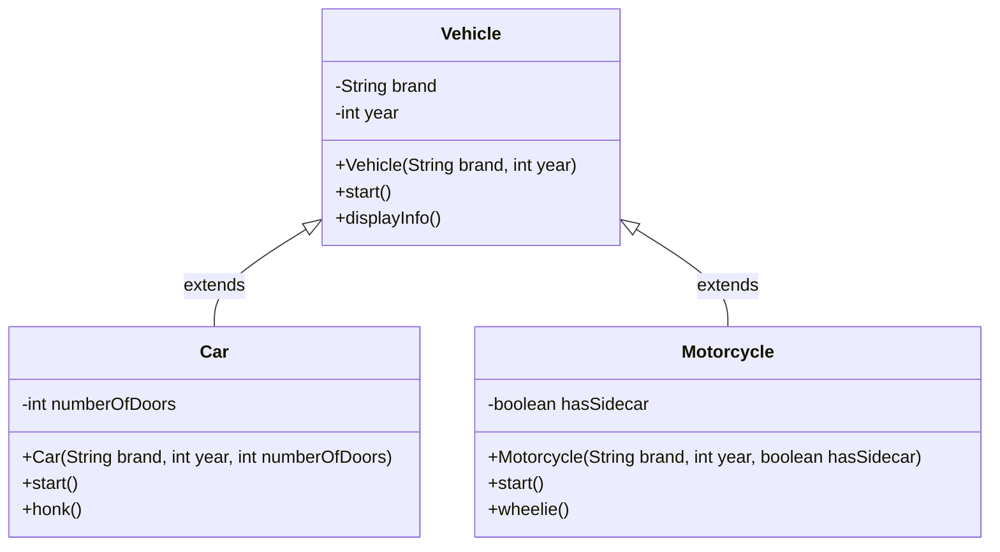

# Inheritance in Java

Learn how to create new classes based on existing classes using inheritance.

## Goal
The goal of this section is to understand how inheritance works in Java, how to use the `extends` keyword, and how to override methods from parent classes.

## Explanation
Inheritance is a fundamental concept in object-oriented programming where a new class (child/subclass) is created based on an existing class (parent/superclass). The child class inherits all the fields and methods from the parent class and can also have its own additional fields and methods.

### Key Concepts
*   **Parent Class (Superclass):** The class being inherited from.
*   **Child Class (Subclass):** The class that inherits from the parent class.
*   **extends Keyword:** Used to create a subclass.
*   **Method Overriding:** Redefining a method from the parent class in the child class.
*   **super Keyword:** Used to refer to the parent class members.

### Benefits of Inheritance
*   Code reusability
*   Method overriding (runtime polymorphism)
*   Hierarchical classification

## Code
Here is an example that demonstrates inheritance in Java:

```java
// Parent class
class Vehicle {
    String brand;
    int year;

    public Vehicle(String brand, int year) {
        this.brand = brand;
        this.year = year;
    }

    public void start() {
        System.out.println("Vehicle is starting...");
    }

    public void displayInfo() {
        System.out.println("Brand: " + brand + ", Year: " + year);
    }
}

// Child class inheriting from Vehicle
class Car extends Vehicle {
    int numberOfDoors;

    public Car(String brand, int year, int numberOfDoors) {
        super(brand, year); // Call parent constructor
        this.numberOfDoors = numberOfDoors;
    }

    // Method overriding
    @Override
    public void start() {
        System.out.println("Car engine is starting...");
    }

    public void honk() {
        System.out.println("Beep beep!");
    }
}

// Another child class
class Motorcycle extends Vehicle {
    boolean hasSidecar;

    public Motorcycle(String brand, int year, boolean hasSidecar) {
        super(brand, year);
        this.hasSidecar = hasSidecar;
    }

    @Override
    public void start() {
        System.out.println("Motorcycle engine is revving...");
    }

    public void wheelie() {
        System.out.println("Motorcycle is doing a wheelie!");
    }
}

// Main class to test inheritance
public class Main {
    public static void main(String[] args) {
        Car myCar = new Car("Toyota", 2022, 4);
        Motorcycle myBike = new Motorcycle("Harley", 2021, false);

        // Inherited method
        myCar.displayInfo();
        myCar.start(); // Overridden method
        myCar.honk();  // Car-specific method

        System.out.println();

        myBike.displayInfo();
        myBike.start(); // Overridden method
        myBike.wheelie(); // Motorcycle-specific method
    }
}
```

## Diagrams


## Pitfalls
*   **Multiple Inheritance:** Java doesn't support multiple inheritance with classes (a class can't extend more than one class).
*   **Private Members:** Private members of the parent class are not inherited.
*   **Constructor Not Inherited:** Parent class constructors are not inherited by the child class.
*   **Forgetting super():** When calling parent constructor from child constructor, `super()` must be the first statement.

## Exercises/Examples
1.  **Create a `Shape` class with `area()` method, then create `Circle` and `Rectangle` classes that inherit from `Shape`.**
    <details>
    <summary>Answer</summary>

    ```java
    class Shape {
        public double area() {
            return 0.0;
        }
    }

    class Circle extends Shape {
        double radius;
        
        public Circle(double radius) {
            this.radius = radius;
        }
        
        @Override
        public double area() {
            return Math.PI * radius * radius;
        }
    }

    class Rectangle extends Shape {
        double length, width;
        
        public Rectangle(double length, double width) {
            this.length = length;
            this.width = width;
        }
        
        @Override
        public double area() {
            return length * width;
        }
    }
    ```
    </details>
2.  **What is the purpose of the `@Override` annotation?**
    <details>
    <summary>Answer</summary>
    The `@Override` annotation tells the compiler that you're intentionally overriding a method from the parent class. It helps catch errors if you accidentally misspell the method name or use wrong parameters.
    </details>
3.  **Can a subclass access private members of its superclass?**
    <details>
    <summary>Answer</summary>
    No, a subclass cannot access private members of its superclass directly. Private members are only accessible within the class where they are declared.
    </details>

## References
*   [Oracle Inheritance](https://docs.oracle.com/javase/tutorial/java/IandI/subclasses.html)
*   [W3Schools Java Inheritance](https://www.w3schools.com/java/java_inheritance.asp)