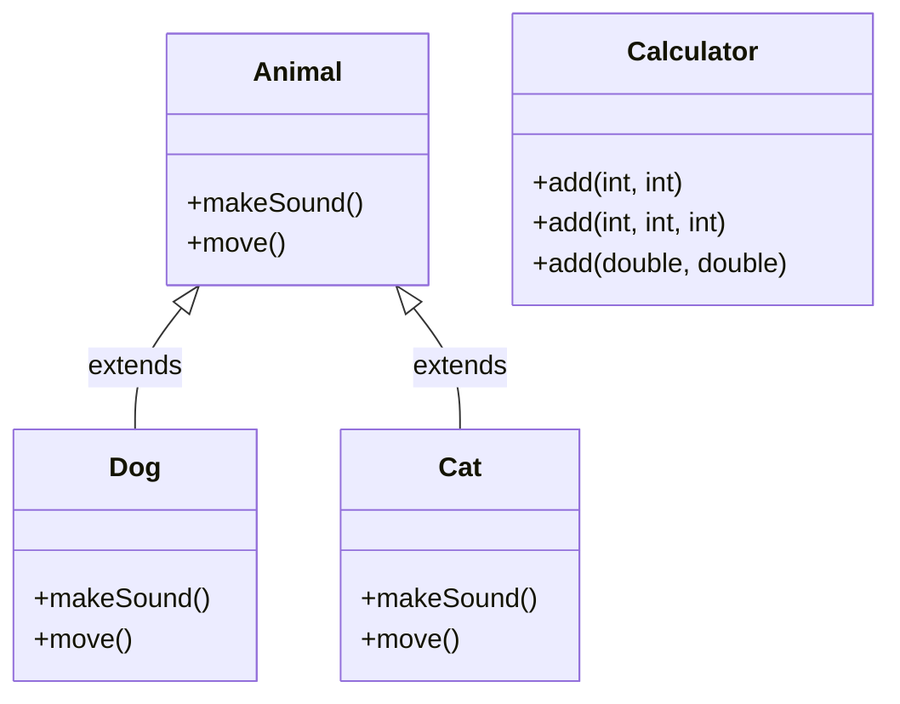

# Polymorphism in Java

Learn how objects can take many forms through method overloading and overriding.

## Goal
The goal of this section is to understand polymorphism in Java, including compile-time (method overloading) and runtime (method overriding) polymorphism, and how to implement them effectively.

## Explanation
Polymorphism means "many forms" and is one of the four fundamental OOP concepts. In Java, polymorphism allows objects to be treated as instances of their parent class rather than their actual class. The same method name can perform different operations based on the object that calls it.

### Types of Polymorphism
1.  **Compile-time Polymorphism (Method Overloading):** Multiple methods with the same name but different parameters in the same class.
2.  **Runtime Polymorphism (Method Overriding):** A subclass provides a specific implementation of a method that is already defined in its parent class.

### Method Overloading
*   Same method name, different parameters (number, type, or order)
*   Happens at compile time
*   Also known as static binding or early binding

### Method Overriding
*   Same method signature in parent and child classes
*   Happens at runtime
*   Also known as dynamic binding or late binding
*   Requires inheritance

## Code
Here is an example that demonstrates both types of polymorphism in Java:

```java
// Method Overloading Example
class Calculator {
    // Method with 2 parameters
    public int add(int a, int b) {
        return a + b;
    }

    // Method with 3 parameters (overloaded)
    public int add(int a, int b, int c) {
        return a + b + c;
    }

    // Method with double parameters (overloaded)
    public double add(double a, double b) {
        return a + b;
    }
}

// Method Overriding Example
class Animal {
    public void makeSound() {
        System.out.println("Animal makes a sound");
    }

    public void move() {
        System.out.println("Animal moves");
    }
}

class Dog extends Animal {
    @Override
    public void makeSound() {
        System.out.println("Dog barks: Woof!");
    }

    @Override
    public void move() {
        System.out.println("Dog runs");
    }
}

class Cat extends Animal {
    @Override
    public void makeSound() {
        System.out.println("Cat meows: Meow!");
    }

    @Override
    public void move() {
        System.out.println("Cat jumps");
    }
}

// Demonstrating runtime polymorphism
public class Main {
    public static void main(String[] args) {
        // Method Overloading Demo
        Calculator calc = new Calculator();
        System.out.println("Method Overloading:");
        System.out.println("2 + 3 = " + calc.add(2, 3));
        System.out.println("2 + 3 + 4 = " + calc.add(2, 3, 4));
        System.out.println("2.5 + 3.7 = " + calc.add(2.5, 3.7));

        System.out.println("\nMethod Overriding Demo:");
        
        // Runtime polymorphism - treating child objects as parent type
        Animal myAnimal = new Animal();
        Animal myDog = new Dog();  // Dog is treated as Animal
        Animal myCat = new Cat();   // Cat is treated as Animal

        // The actual method called depends on the object's actual type
        myAnimal.makeSound();
        myDog.makeSound();  // Calls Dog's makeSound()
        myCat.makeSound();  // Calls Cat's makeSound()

        // Another example with array
        System.out.println("\nArray of Animals:");
        Animal[] animals = {new Animal(), new Dog(), new Cat()};
        
        for (Animal animal : animals) {
            animal.makeSound();  // Different behavior based on actual object type
            animal.move();       // Different behavior based on actual object type
            System.out.println("---");
        }
    }
}
```

## Diagrams


## Pitfalls
*   **Overloading vs Overriding Confusion:** Method overloading happens in the same class with different parameters, while overriding happens between parent and child classes with the same signature.
*   **Return Type in Overriding:** The return type must be the same or a subtype (covariant return type) when overriding methods.
*   **Access Modifiers:** Overridden methods cannot have more restrictive access modifiers than the parent method.
*   **Static Methods:** Static methods cannot be overridden, they can only be hidden.

## Exercises/Examples
1.  **Create a `Shape` class with an `area()` method, then create `Circle` and `Rectangle` classes that override this method.**
    <details>
    <summary>Answer</summary>

    ```java
    class Shape {
        public double area() {
            return 0.0;
        }
    }

    class Circle extends Shape {
        double radius;
        
        public Circle(double radius) {
            this.radius = radius;
        }
        
        @Override
        public double area() {
            return Math.PI * radius * radius;
        }
    }

    class Rectangle extends Shape {
        double length, width;
        
        public Rectangle(double length, double width) {
            this.length = length;
            this.width = width;
        }
        
        @Override
        public double area() {
            return length * width;
        }
    }
    ```
    </details>
2.  **Create a method overloading example with a `print()` method that can print different types of data.**
    <details>
    <summary>Answer</summary>

    ```java
    class Printer {
        public void print(String text) {
            System.out.println("String: " + text);
        }
        
        public void print(int number) {
            System.out.println("Integer: " + number);
        }
        
        public void print(double number) {
            System.out.println("Double: " + number);
        }
        
        public void print(String text, int times) {
            for (int i = 0; i < times; i++) {
                System.out.println(text);
            }
        }
    }
    ```
    </details>
3.  **What is the difference between compile-time and runtime polymorphism?**
    <details>
    <summary>Answer</summary>
    Compile-time polymorphism (method overloading) is resolved during compilation based on method signatures. Runtime polymorphism (method overriding) is resolved during execution based on the actual object type.
    </details>

## References
*   [Oracle Polymorphism](https://docs.oracle.com/javase/tutorial/java/IandI/polymorphism.html)
*   [W3Schools Java Polymorphism](https://www.w3schools.com/java/java_polymorphism.asp)