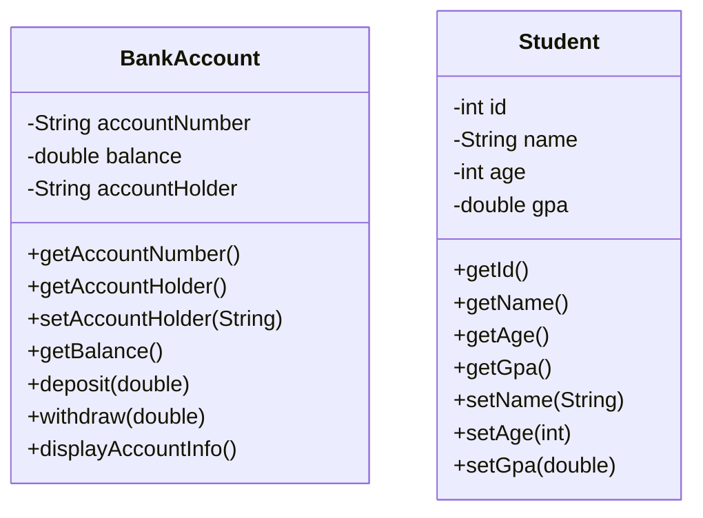

# Encapsulation in Java

Learn how to protect data by hiding implementation details and providing controlled access.

## Goal
The goal of this section is to understand encapsulation in Java, how to use access modifiers, and how to implement getter and setter methods to control access to class fields.

## Explanation
Encapsulation is one of the four fundamental OOP concepts. It refers to the bundling of data (fields) and methods that operate on that data within a single unit (class), while restricting direct access to some of the object's components. This is also known as data hiding.

### Key Principles
*   **Data Hiding:** Keep fields private to prevent direct external access
*   **Controlled Access:** Provide public methods (getters and setters) to access and modify private fields
*   **Validation:** Add logic in setter methods to validate data before setting it
*   **Abstraction:** Hide complex implementation details from the user

### Access Modifiers
*   **private:** Accessible only within the same class
*   **public:** Accessible from anywhere
*   **protected:** Accessible within the same package and subclasses
*   **default (no modifier):** Accessible only within the same package

### Benefits of Encapsulation
*   Better control of class fields and methods
*   Fields can be made read-only (if you don't create a setter) or write-only (if you don't create a getter)
*   Flexibility: You can change one part of the code without affecting other parts
*   Increased security

## Code
Here is an example that demonstrates encapsulation in Java:

```java
// Example of proper encapsulation
public class BankAccount {
    // Private fields - cannot be accessed directly from outside
    private String accountNumber;
    private double balance;
    private String accountHolder;

    // Constructor
    public BankAccount(String accountNumber, String accountHolder, double initialBalance) {
        this.accountNumber = accountNumber;
        this.accountHolder = accountHolder;
        // Validate initial balance
        if (initialBalance >= 0) {
            this.balance = initialBalance;
        } else {
            this.balance = 0.0;
        }
    }

    // Getter for accountNumber (read-only)
    public String getAccountNumber() {
        return accountNumber;
    }

    // Getter for accountHolder
    public String getAccountHolder() {
        return accountHolder;
    }

    // Getter for balance (read-only)
    public double getBalance() {
        return balance;
    }

    // Setter for accountHolder with validation
    public void setAccountHolder(String accountHolder) {
        if (accountHolder != null && !accountHolder.trim().isEmpty()) {
            this.accountHolder = accountHolder;
        }
    }

    // Business method with validation
    public boolean deposit(double amount) {
        if (amount > 0) {
            balance += amount;
            System.out.println("Deposited: $" + amount);
            return true;
        }
        System.out.println("Invalid deposit amount");
        return false;
    }

    // Business method with validation
    public boolean withdraw(double amount) {
        if (amount > 0 && amount <= balance) {
            balance -= amount;
            System.out.println("Withdrawn: $" + amount);
            return true;
        }
        System.out.println("Invalid withdrawal amount or insufficient funds");
        return false;
    }

    // Method to display account info
    public void displayAccountInfo() {
        System.out.println("Account Number: " + accountNumber);
        System.out.println("Account Holder: " + accountHolder);
        System.out.println("Balance: $" + balance);
    }
}

// Another example: Student class
class Student {
    private int id;
    private String name;
    private int age;
    private double gpa;

    public Student(int id, String name, int age, double gpa) {
        this.id = id;
        setName(name);  // Use setter to validate
        setAge(age);    // Use setter to validate
        setGpa(gpa);    // Use setter to validate
    }

    // Getters
    public int getId() {
        return id;
    }

    public String getName() {
        return name;
    }

    public int getAge() {
        return age;
    }

    public double getGpa() {
        return gpa;
    }

    // Setters with validation
    public void setName(String name) {
        if (name != null && !name.trim().isEmpty()) {
            this.name = name.trim();
        }
    }

    public void setAge(int age) {
        if (age > 0 && age < 150) {
            this.age = age;
        }
    }

    public void setGpa(double gpa) {
        if (gpa >= 0.0 && gpa <= 4.0) {
            this.gpa = gpa;
        }
    }
}

// Main class to test encapsulation
public class Main {
    public static void main(String[] args) {
        // Test BankAccount
        BankAccount account = new BankAccount("123456789", "John Doe", 1000.0);
        
        // Try to access private fields directly (this would cause compilation error)
        // account.balance = 5000.0; // ERROR: balance has private access
        
        // Use public methods to interact with the object
        account.displayAccountInfo();
        account.deposit(500.0);
        account.withdraw(200.0);
        account.withdraw(2000.0); // This should fail
        account.displayAccountInfo();
        
        System.out.println("\n--- Student Example ---");
        
        // Test Student
        Student student = new Student(1, "Alice Smith", 20, 3.5);
        System.out.println("Student: " + student.getName() + ", Age: " + student.getAge() + ", GPA: " + student.getGpa());
        
        // Try to set invalid values
        student.setAge(-5);  // This should not change the age
        student.setGpa(5.0); // This should not change the GPA
        
        System.out.println("After invalid attempts - Age: " + student.getAge() + ", GPA: " + student.getGpa());
    }
}
```

## Diagrams


## Pitfalls
*   **Exposing Internal State:** Making fields public breaks encapsulation
*   **Missing Validation:** Not validating data in setters can lead to invalid object states
*   **Over-Encapsulation:** Creating getters/setters for every field without considering if they're needed
*   **Direct Field Access:** Even within the same class, avoid direct field access when getters/setters are available
*   **Mutable Objects:** Returning mutable objects from getters can compromise encapsulation

## Exercises/Examples
1.  **Create a `Person` class with private fields for name and age, with proper validation in setters.**
    <details>
    <summary>Answer</summary>

    ```java
    class Person {
        private String name;
        private int age;

        public Person(String name, int age) {
            setName(name);
            setAge(age);
        }

        public String getName() {
            return name;
        }

        public void setName(String name) {
            if (name != null && !name.trim().isEmpty()) {
                this.name = name.trim();
            }
        }

        public int getAge() {
            return age;
        }

        public void setAge(int age) {
            if (age >= 0 && age <= 150) {
                this.age = age;
            }
        }
    }
    ```
    </details>
2.  **Why should fields be private and accessed through methods?**
    <details>
    <summary>Answer</summary>
    Private fields with public methods provide better control over data access and modification. You can add validation, logging, or change the internal implementation without affecting external code that uses the class.
    </details>
3.  **Create a read-only field (only getter, no setter).**
    <details>
    <summary>Answer</summary>

    ```java
    class Product {
        private final String productId;  // Read-only field
        private String name;

        public Product(String productId, String name) {
            this.productId = productId;
            this.name = name;
        }

        public String getProductId() {
            return productId;
        }

        // No setter for productId - making it read-only
        
        public String getName() {
            return name;
        }

        public void setName(String name) {
            this.name = name;
        }
    }
    ```
    </details>

## References
*   [Oracle Encapsulation](https://docs.oracle.com/javase/tutorial/java/javaOO/accesscontrol.html)
*   [W3Schools Java Encapsulation](https://www.w3schools.com/java/java_encapsulation.asp)