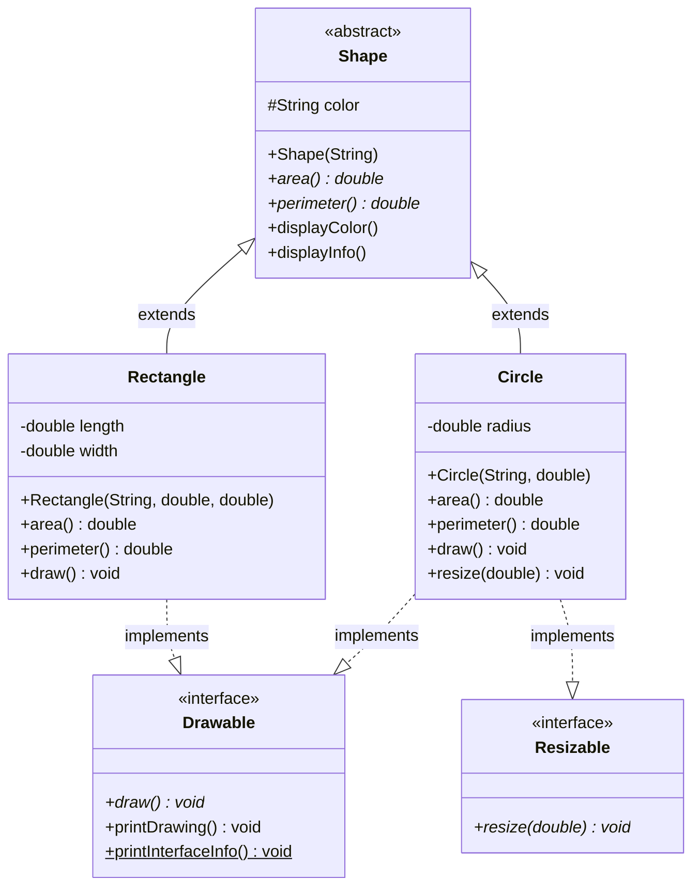

# Abstraction in Java

Learn how to hide implementation details and show only essential features to users.

## Goal
The goal of this section is to understand abstraction in Java, how to use abstract classes and interfaces, and how they help achieve abstraction in object-oriented programming.

## Explanation
Abstraction is one of the four fundamental OOP concepts. It means hiding complex implementation details and showing only the essential features of an object. In Java, abstraction is achieved through abstract classes and interfaces.

### Abstract Classes
*   Cannot be instantiated (cannot create objects directly)
*   Can have both abstract methods (without implementation) and concrete methods (with implementation)
*   Use the `abstract` keyword
*   A class must be declared abstract if it contains abstract methods
*   Subclasses must implement all abstract methods or be declared abstract themselves

### Interfaces
*   A completely abstract class (until Java 8)
*   Can only contain abstract methods (until Java 8) and static final variables
*   Use the `interface` keyword
*   A class can implement multiple interfaces
*   From Java 8 onwards, interfaces can have default and static methods with implementation

### Key Differences
*   **Abstract Class:** Can have constructors, can have both abstract and concrete methods, supports single inheritance
*   **Interface:** Cannot have constructors, all methods are public (until Java 8), supports multiple inheritance

## Code
Here is an example that demonstrates abstraction using both abstract classes and interfaces in Java:

```java
// Abstract class example
abstract class Shape {
    protected String color;
    
    public Shape(String color) {
        this.color = color;
    }
    
    // Abstract method - must be implemented by subclasses
    public abstract double area();
    
    // Abstract method - must be implemented by subclasses
    public abstract double perimeter();
    
    // Concrete method - can be used by subclasses
    public void displayColor() {
        System.out.println("Color: " + color);
    }
    
    // Concrete method
    public void displayInfo() {
        System.out.println("Shape Information:");
        displayColor();
        System.out.println("Area: " + area());
        System.out.println("Perimeter: " + perimeter());
    }
}

// Interface example
interface Drawable {
    void draw();  // public abstract by default
    
    // Java 8+: Default method with implementation
    default void printDrawing() {
        System.out.println("Drawing in progress...");
    }
    
    // Java 8+: Static method
    static void printInterfaceInfo() {
        System.out.println("This is Drawable interface");
    }
}

// Another interface
interface Resizable {
    void resize(double factor);
}

// Concrete class implementing abstraction
class Circle extends Shape implements Drawable, Resizable {
    private double radius;
    
    public Circle(String color, double radius) {
        super(color);
        this.radius = radius;
    }
    
    @Override
    public double area() {
        return Math.PI * radius * radius;
    }
    
    @Override
    public double perimeter() {
        return 2 * Math.PI * radius;
    }
    
    @Override
    public void draw() {
        System.out.println("Drawing a circle with radius " + radius);
    }
    
    @Override
    public void resize(double factor) {
        radius *= factor;
    }
}

// Another concrete class
class Rectangle extends Shape implements Drawable {
    private double length;
    private double width;
    
    public Rectangle(String color, double length, double width) {
        super(color);
        this.length = length;
        this.width = width;
    }
    
    @Override
    public double area() {
        return length * width;
    }
    
    @Override
    public double perimeter() {
        return 2 * (length + width);
    }
    
    @Override
    public void draw() {
        System.out.println("Drawing a rectangle with length " + length + " and width " + width);
    }
}

// Main class to test abstraction
public class Main {
    public static void main(String[] args) {
        // Cannot create object of abstract class
        // Shape shape = new Shape("red"); // ERROR!
        
        System.out.println("=== Circle Example ===");
        Circle circle = new Circle("Red", 5.0);
        circle.displayInfo();
        circle.draw();
        circle.printDrawing();
        
        System.out.println("\nResizing circle by factor 2...");
        circle.resize(2);
        circle.displayInfo();
        
        System.out.println("\n=== Rectangle Example ===");
        Rectangle rectangle = new Rectangle("Blue", 4.0, 6.0);
        rectangle.displayInfo();
        rectangle.draw();
        
        System.out.println("\n=== Polymorphism with Abstraction ===");
        // Using abstract class reference
        Shape shape1 = new Circle("Green", 3.0);
        Shape shape2 = new Rectangle("Yellow", 2.0, 3.0);
        
        shape1.displayInfo();
        System.out.println();
        shape2.displayInfo();
        
        System.out.println("\n=== Interface Static Method ===");
        Drawable.printInterfaceInfo();
    }
}
```

## Diagrams


## Pitfalls
*   **Instantiating Abstract Classes:** Cannot create objects of abstract classes directly
*   **Missing Implementation:** All abstract methods must be implemented in concrete subclasses
*   **Interface Variables:** All variables in interfaces are public, static, and final by default
*   **Multiple Inheritance Conflicts:** When implementing multiple interfaces with default methods having the same signature
*   **Abstract Class vs Interface Choice:** Use abstract class when you want to share code; use interface when you want to define a contract

## Exercises/Examples
1.  **Create an abstract class `Animal` with abstract methods `makeSound()` and `move()`. Then create `Dog` and `Cat` classes that extend it.**
    <details>
    <summary>Answer</summary>

    ```java
    abstract class Animal {
        protected String name;
        
        public Animal(String name) {
            this.name = name;
        }
        
        public abstract void makeSound();
        public abstract void move();
        
        public void sleep() {
            System.out.println(name + " is sleeping");
        }
    }

    class Dog extends Animal {
        public Dog(String name) {
            super(name);
        }
        
        @Override
        public void makeSound() {
            System.out.println(name + " barks: Woof!");
        }
        
        @Override
        public void move() {
            System.out.println(name + " runs");
        }
    }

    class Cat extends Animal {
        public Cat(String name) {
            super(name);
        }
        
        @Override
        public void makeSound() {
            System.out.println(name + " meows: Meow!");
        }
        
        @Override
        public void move() {
            System.out.println(name + " jumps");
        }
    }
    ```
    </details>
2.  **Create an interface `PaymentMethod` with methods `makePayment(double amount)` and `getBalance()`. Implement it in `CreditCard` and `PayPal` classes.**
    <details>
    <summary>Answer</summary>

    ```java
    interface PaymentMethod {
        boolean makePayment(double amount);
        double getBalance();
    }

    class CreditCard implements PaymentMethod {
        private double balance;
        private String cardNumber;
        
        public CreditCard(String cardNumber, double initialBalance) {
            this.cardNumber = cardNumber;
            this.balance = initialBalance;
        }
        
        @Override
        public boolean makePayment(double amount) {
            if (amount <= balance) {
                balance -= amount;
                return true;
            }
            return false;
        }
        
        @Override
        public double getBalance() {
            return balance;
        }
    }

    class PayPal implements PaymentMethod {
        private double balance;
        private String email;
        
        public PayPal(String email, double initialBalance) {
            this.email = email;
            this.balance = initialBalance;
        }
        
        @Override
        public boolean makePayment(double amount) {
            if (amount <= balance) {
                balance -= amount;
                return true;
            }
            return false;
        }
        
        @Override
        public double getBalance() {
            return balance;
        }
    }
    ```
    </details>
3.  **When should you use an abstract class vs an interface?**
    <details>
    <summary>Answer</summary>
    Use an abstract class when you want to provide common implementation code to subclasses, when you need constructors or instance variables, or when you want to restrict usage to a class hierarchy. Use an interface when you want to define a contract that multiple unrelated classes can implement, when you need multiple inheritance, or when you want to define only behavior without implementation.
    </details>

## References
*   [Oracle Abstract Classes and Methods](https://docs.oracle.com/javase/tutorial/java/IandI/abstract.html)
*   [Oracle Interfaces](https://docs.oracle.com/javase/tutorial/java/IandI/createinterface.html)
*   [W3Schools Java Abstraction](https://www.w3schools.com/java/java_abstract.asp)