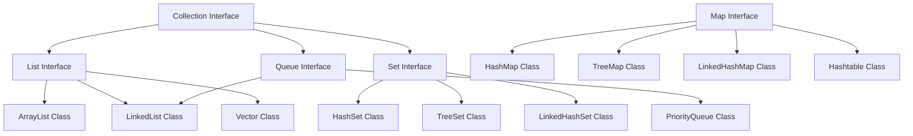

# Collections in Java

Learn how to store and manipulate groups of objects using Java Collections Framework.

## Goal
The goal of this section is to understand Java Collections Framework, including Lists, Sets, Maps, and their common implementations, along with when to use each type.

## Explanation
The Java Collections Framework provides a set of classes and interfaces for storing and manipulating groups of objects. It offers a unified architecture for representing and manipulating collections, making code more reusable and easier to maintain.

### Key Interfaces
*   **Collection:** Root interface for all collections
*   **List:** Ordered collection that allows duplicate elements
*   **Set:** Collection that doesn't allow duplicate elements
*   **Map:** Key-value pairs (not a true collection)
*   **Queue:** Collection designed for holding elements prior to processing

### Common Implementations
*   **ArrayList:** Resizable array implementation of List
*   **LinkedList:** Doubly-linked list implementation of List and Queue
*   **HashSet:** Hash table implementation of Set
*   **TreeSet:** Tree-based implementation of SortedSet
*   **HashMap:** Hash table implementation of Map
*   **TreeMap:** Tree-based implementation of SortedMap

### Key Features
*   **Generics:** Type-safe collections
*   **Autoboxing/Unboxing:** Automatic conversion between primitives and wrapper objects
*   **Enhanced for-loop:** Simplified iteration
*   **Utility Methods:** Collections class provides static utility methods

## Code
Here is an example that demonstrates various collection types in Java:

```java
import java.util.*;

public class CollectionsExample {
    public static void main(String[] args) {
        System.out.println("=== LIST EXAMPLES ===");
        
        // ArrayList example
        List<String> arrayList = new ArrayList<>();
        arrayList.add("Apple");
        arrayList.add("Banana");
        arrayList.add("Orange");
        arrayList.add("Apple");  // Duplicates allowed
        
        System.out.println("ArrayList: " + arrayList);
        System.out.println("Element at index 1: " + arrayList.get(1));
        System.out.println("Size: " + arrayList.size());
        
        // LinkedList example
        List<String> linkedList = new LinkedList<>();
        linkedList.add("First");
        linkedList.add("Second");
        linkedList.add(1, "Middle");  // Insert at specific position
        
        System.out.println("LinkedList: " + linkedList);
        
        System.out.println("\n=== SET EXAMPLES ===");
        
        // HashSet example - no duplicates, no guaranteed order
        Set<String> hashSet = new HashSet<>();
        hashSet.add("Java");
        hashSet.add("Python");
        hashSet.add("JavaScript");
        hashSet.add("Java");  // Duplicate - won't be added
        
        System.out.println("HashSet: " + hashSet);
        
        // TreeSet example - sorted order
        Set<Integer> treeSet = new TreeSet<>();
        treeSet.add(5);
        treeSet.add(2);
        treeSet.add(8);
        treeSet.add(1);
        
        System.out.println("TreeSet (sorted): " + treeSet);
        
        System.out.println("\n=== MAP EXAMPLES ===");
        
        // HashMap example
        Map<String, Integer> hashMap = new HashMap<>();
        hashMap.put("Apple", 5);
        hashMap.put("Banana", 3);
        hashMap.put("Orange", 7);
        hashMap.put("Apple", 10);  // Updates existing value
        
        System.out.println("HashMap: " + hashMap);
        System.out.println("Apple quantity: " + hashMap.get("Apple"));
        System.out.println("Contains Banana? " + hashMap.containsKey("Banana"));
        
        // TreeMap example - sorted by keys
        Map<String, String> treeMap = new TreeMap<>();
        treeMap.put("Zebra", "Animal");
        treeMap.put("Apple", "Fruit");
        treeMap.put("Car", "Vehicle");
        
        System.out.println("TreeMap (sorted by key): " + treeMap);
        
        System.out.println("\n=== ITERATION EXAMPLES ===");
        
        // Enhanced for-loop
        System.out.println("Enhanced for-loop:");
        for (String fruit : arrayList) {
            System.out.print(fruit + " ");
        }
        System.out.println();
        
        // Iterator
        System.out.println("Iterator:");
        Iterator<String> iterator = hashSet.iterator();
        while (iterator.hasNext()) {
            System.out.print(iterator.next() + " ");
        }
        System.out.println();
        
        // Map entry iteration
        System.out.println("Map entry iteration:");
        for (Map.Entry<String, Integer> entry : hashMap.entrySet()) {
            System.out.println(entry.getKey() + ": " + entry.getValue());
        }
        
        System.out.println("\n=== UTILITY METHODS ===");
        
        List<Integer> numbers = Arrays.asList(5, 2, 8, 1, 9, 3);
        System.out.println("Original list: " + numbers);
        
        Collections.sort(numbers);
        System.out.println("Sorted list: " + numbers);
        
        Collections.reverse(numbers);
        System.out.println("Reversed list: " + numbers);
        
        System.out.println("Max: " + Collections.max(numbers));
        System.out.println("Min: " + Collections.min(numbers));
        
        // Convert array to List
        String[] array = {"A", "B", "C"};
        List<String> listFromArray = Arrays.asList(array);
        System.out.println("List from array: " + listFromArray);
    }
}
```

## Diagrams


## Pitfalls
*   **ConcurrentModificationException:** Modifying a collection while iterating over it
*   **Null Values:** Some collections don't allow null values (TreeSet, TreeMap)
*   **Type Safety:** Forgetting to use generics can lead to ClassCastException
*   **Performance:** Choosing the wrong collection type for your use case
*   **Memory Leaks:** Not removing references from collections when objects are no longer needed
*   **HashCode and Equals:** Not properly implementing these methods in custom objects used in HashSet/HashMap

## Exercises/Examples
1.  **Create a program that stores student names and their grades using a Map, then calculates the average grade.**
    <details>
    <summary>Answer</summary>

    ```java
    import java.util.*;
    
    public class StudentGrades {
        public static void main(String[] args) {
            Map<String, Double> studentGrades = new HashMap<>();
            studentGrades.put("Alice", 85.5);
            studentGrades.put("Bob", 92.0);
            studentGrades.put("Charlie", 78.5);
            
            double sum = 0;
            for (double grade : studentGrades.values()) {
                sum += grade;
            }
            
            double average = sum / studentGrades.size();
            System.out.println("Average grade: " + average);
        }
    }
    ```
    </details>
2.  **Write a method to remove duplicates from a List.**
    <details>
    <summary>Answer</summary>

    ```java
    public static <T> List<T> removeDuplicates(List<T> list) {
        return new ArrayList<>(new LinkedHashSet<>(list));
    }
    
    // Usage
    List<String> withDuplicates = Arrays.asList("A", "B", "A", "C", "B");
    List<String> withoutDuplicates = removeDuplicates(withDuplicates);
    System.out.println(withoutDuplicates); // [A, B, C]
    ```
    </details>
3.  **What is the difference between HashMap and TreeMap?**
    <details>
    <summary>Answer</summary>
    HashMap stores key-value pairs in a hash table, provides O(1) time complexity for basic operations, and doesn't maintain any order. TreeMap stores key-value pairs in a sorted tree structure, provides O(log n) time complexity, and maintains keys in sorted order.
    </details>

## References
*   [Oracle Collections Framework](https://docs.oracle.com/javase/tutorial/collections/index.html)
*   [Java Collections Documentation](https://docs.oracle.com/javase/8/docs/technotes/guides/collections/overview.html)
*   [W3Schools Java Collections](https://www.w3schools.com/java/java_collections.asp)