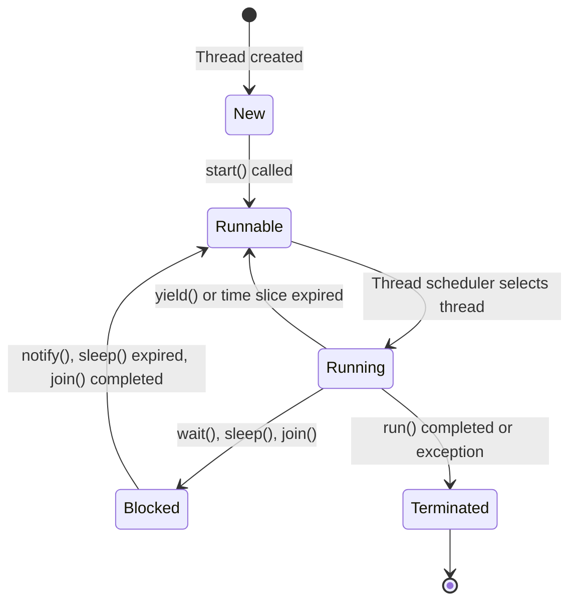

# Multithreading in Java

Learn how to create and manage multiple threads of execution for concurrent programming.

## Goal
The goal of this section is to understand multithreading concepts in Java, how to create threads, manage thread lifecycle, handle synchronization, and avoid common concurrency issues.

## Explanation
Multithreading allows a program to perform multiple tasks concurrently. Java provides built-in support for multithreading through the Thread class and Runnable interface. Each thread represents a separate path of execution.

### Key Concepts
*   **Thread:** A lightweight subprocess, the smallest unit of processing
*   **Process:** A program in execution
*   **Concurrency:** Multiple tasks making progress over the same time period
*   **Parallelism:** Multiple tasks executing simultaneously
*   **Synchronization:** Coordinating access to shared resources

### Creating Threads
1.  **Extending Thread class:** Override the `run()` method
2.  **Implementing Runnable interface:** Implement the `run()` method and pass to Thread constructor

### Thread Lifecycle
*   **New:** Thread is created but not started
*   **Runnable:** Thread is ready to run but waiting for CPU time
*   **Running:** Thread is currently executing
*   **Blocked/Waiting:** Thread is waiting for a resource or another thread
*   **Terminated:** Thread has finished execution

### Synchronization
*   **synchronized keyword:** Ensures only one thread can access a method/block at a time
*   **Locks:** Explicit locking mechanisms for fine-grained control
*   **Deadlock:** When threads wait for each other indefinitely

## Code
Here is an example that demonstrates multithreading in Java:

```java
// Method 1: Extending Thread class
class MyThread extends Thread {
    private String threadName;
    
    public MyThread(String name) {
        this.threadName = name;
    }
    
    @Override
    public void run() {
        for (int i = 1; i <= 5; i++) {
            System.out.println(threadName + " is running - Count: " + i);
            try {
                Thread.sleep(1000); // Sleep for 1 second
            } catch (InterruptedException e) {
                System.out.println(threadName + " was interrupted");
            }
        }
        System.out.println(threadName + " finished execution");
    }
}

// Method 2: Implementing Runnable interface
class MyRunnable implements Runnable {
    private String threadName;
    
    public MyRunnable(String name) {
        this.threadName = name;
    }
    
    @Override
    public void run() {
        for (int i = 1; i <= 5; i++) {
            System.out.println(threadName + " (Runnable) is running - Count: " + i);
            try {
                Thread.sleep(800);
            } catch (InterruptedException e) {
                System.out.println(threadName + " was interrupted");
            }
        }
        System.out.println(threadName + " (Runnable) finished execution");
    }
}

// Synchronization example
class Counter {
    private int count = 0;
    
    // Synchronized method - only one thread can access at a time
    public synchronized void increment() {
        count++;
    }
    
    // Alternative: synchronized block
    public void incrementWithBlock() {
        synchronized(this) {
            count++;
        }
    }
    
    public int getCount() {
        return count;
    }
}

// Thread-safe example
class BankAccount {
    private double balance;
    
    public BankAccount(double initialBalance) {
        this.balance = initialBalance;
    }
    
    // Synchronized method to prevent race conditions
    public synchronized void deposit(double amount) {
        if (amount > 0) {
            balance += amount;
            System.out.println(Thread.currentThread().getName() + " deposited " + amount + ". New balance: " + balance);
        }
    }
    
    public synchronized void withdraw(double amount) {
        if (amount > 0 && amount <= balance) {
            balance -= amount;
            System.out.println(Thread.currentThread().getName() + " withdrew " + amount + ". New balance: " + balance);
        }
    }
    
    public synchronized double getBalance() {
        return balance;
    }
}

// Producer-Consumer example
class SharedBuffer {
    private int data;
    private boolean available = false;
    
    // Producer method
    public synchronized void put(int value) {
        while (available) {
            try {
                wait(); // Wait for consumer to consume
            } catch (InterruptedException e) {
                e.printStackTrace();
            }
        }
        data = value;
        available = true;
        System.out.println("Producer produced: " + value);
        notify(); // Notify consumer
    }
    
    // Consumer method
    public synchronized int get() {
        while (!available) {
            try {
                wait(); // Wait for producer to produce
            } catch (InterruptedException e) {
                e.printStackTrace();
            }
        }
        available = false;
        System.out.println("Consumer consumed: " + data);
        notify(); // Notify producer
        return data;
    }
}

// Main class to test multithreading
public class Main {
    public static void main(String[] args) {
        System.out.println("=== Basic Thread Creation ===");
        
        // Creating threads by extending Thread class
        MyThread thread1 = new MyThread("Thread-1");
        MyThread thread2 = new MyThread("Thread-2");
        
        // Creating threads using Runnable
        Thread thread3 = new Thread(new MyRunnable("Runnable-1"));
        Thread thread4 = new Thread(new MyRunnable("Runnable-2"));
        
        // Start threads
        thread1.start();
        thread2.start();
        thread3.start();
        thread4.start();
        
        // Wait for threads to complete
        try {
            thread1.join();
            thread2.join();
            thread3.join();
            thread4.join();
        } catch (InterruptedException e) {
            e.printStackTrace();
        }
        
        System.out.println("\n=== Synchronization Example ===");
        
        // Counter example without synchronization (commented out to avoid confusion)
        // Counter counter = new Counter();
        
        // Race condition demonstration
        Counter sharedCounter = new Counter();
        
        // Create multiple threads that increment the counter
        Thread[] counterThreads = new Thread[10];
        for (int i = 0; i < counterThreads.length; i++) {
            counterThreads[i] = new Thread(() -> {
                for (int j = 0; j < 1000; j++) {
                    sharedCounter.increment();
                }
            });
            counterThreads[i].start();
        }
        
        // Wait for all threads to complete
        for (Thread t : counterThreads) {
            try {
                t.join();
            } catch (InterruptedException e) {
                e.printStackTrace();
            }
        }
        
        System.out.println("Final counter value: " + sharedCounter.getCount());
        System.out.println("Expected value: 10000");
        
        System.out.println("\n=== Bank Account Example ===");
        
        BankAccount account = new BankAccount(1000);
        
        Thread depositor1 = new Thread(() -> {
            for (int i = 0; i < 5; i++) {
                account.deposit(100);
                try {
                    Thread.sleep(100);
                } catch (InterruptedException e) {
                    e.printStackTrace();
                }
            }
        }, "Depositor-1");
        
        Thread depositor2 = new Thread(() -> {
            for (int i = 0; i < 5; i++) {
                account.deposit(150);
                try {
                    Thread.sleep(150);
                } catch (InterruptedException e) {
                    e.printStackTrace();
                }
            }
        }, "Depositor-2");
        
        depositor1.start();
        depositor2.start();
        
        try {
            depositor1.join();
            depositor2.join();
        } catch (InterruptedException e) {
            e.printStackTrace();
        }
        
        System.out.println("Final account balance: " + account.getBalance());
        
        System.out.println("\n=== Producer-Consumer Example ===");
        
        SharedBuffer buffer = new SharedBuffer();
        
        Thread producer = new Thread(() -> {
            for (int i = 1; i <= 5; i++) {
                buffer.put(i);
                try {
                    Thread.sleep(500);
                } catch (InterruptedException e) {
                    e.printStackTrace();
                }
            }
        }, "Producer");
        
        Thread consumer = new Thread(() -> {
            for (int i = 1; i <= 5; i++) {
                buffer.get();
                try {
                    Thread.sleep(800);
                } catch (InterruptedException e) {
                    e.printStackTrace();
                }
            }
        }, "Consumer");
        
        producer.start();
        consumer.start();
        
        try {
            producer.join();
            consumer.join();
        } catch (InterruptedException e) {
            e.printStackTrace();
        }
        
        System.out.println("\nMain thread finished execution");
    }
}
```

## Diagrams


## Pitfalls
*   **Race Conditions:** When multiple threads access shared data simultaneously
*   **Deadlocks:** When threads wait for each other indefinitely
*   **Starvation:** When a thread never gets access to resources
*   **Thread Interruption:** Not properly handling InterruptedException
*   **Memory Consistency Errors:** When different threads have inconsistent views of shared data
*   **Over-Synchronization:** Synchronizing more than necessary, reducing performance

## Exercises/Examples
1.  **Create a program where two threads print even and odd numbers alternately.**
    <details>
    <summary>Answer</summary>

    ```java
    class NumberPrinter {
        private int number = 1;
        private boolean isEvenTurn = false;
        
        public synchronized void printEven() {
            while (!isEvenTurn) {
                try {
                    wait();
                } catch (InterruptedException e) {
                    e.printStackTrace();
                }
            }
            System.out.println(Thread.currentThread().getName() + ": " + number);
            number++;
            isEvenTurn = false;
            notify();
        }
        
        public synchronized void printOdd() {
            while (isEvenTurn) {
                try {
                    wait();
                } catch (InterruptedException e) {
                    e.printStackTrace();
                }
            }
            System.out.println(Thread.currentThread().getName() + ": " + number);
            number++;
            isEvenTurn = true;
            notify();
        }
    }
    ```
    </details>
2.  **What is the difference between Thread and Runnable?**
    <details>
    <summary>Answer</summary>
    Thread is a class that represents a thread of execution, while Runnable is an interface that should be implemented by any class whose instances are intended to be executed by a thread. Extending Thread limits you to single inheritance, while implementing Runnable allows you to extend other classes.
    </details>
3.  **When should you use synchronization?**
    <details>
    <summary>Answer</summary>
    Use synchronization when multiple threads access shared mutable data and at least one thread modifies it. This prevents race conditions and ensures thread safety.
    </details>

## References
*   [Oracle Concurrency](https://docs.oracle.com/javase/tutorial/essential/concurrency/index.html)
*   [Java Thread Documentation](https://docs.oracle.com/javase/8/docs/api/java/lang/Thread.html)
*   [W3Schools Java Threads](https://www.w3schools.com/java/java_threads.asp)