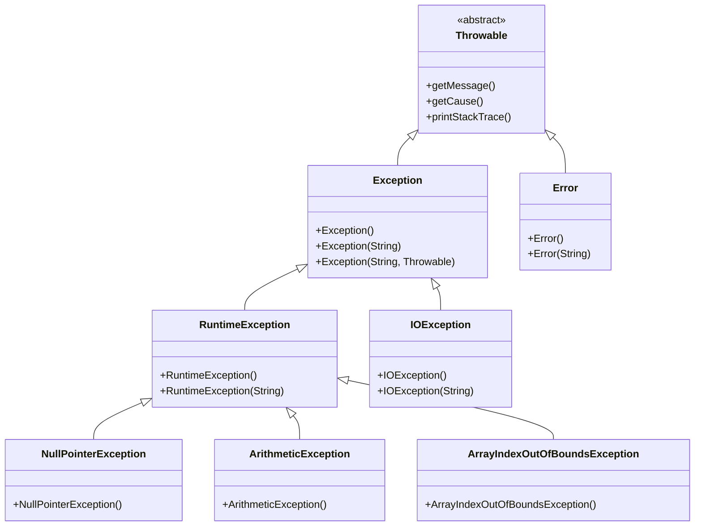

# Exception Handling in Java

Learn how to handle runtime errors and exceptional conditions in Java programs.

## Goal
The goal of this section is to understand Java's exception handling mechanism, including try-catch blocks, different types of exceptions, creating custom exceptions, and best practices for error handling.

## Explanation
Exception handling is a powerful mechanism that allows Java programs to detect and handle runtime errors gracefully. When an error occurs, Java creates an exception object and throws it, which can then be caught and handled by appropriate code.

### Exception Hierarchy
*   **Throwable:** Root class of all errors and exceptions
*   **Error:** Serious problems that applications should not try to handle
*   **Exception:** Conditions that applications might want to catch
    *   **Checked Exceptions:** Must be declared or handled (IOException, SQLException)
    *   **Unchecked Exceptions:** Runtime exceptions that don't need to be declared (NullPointerException, ArrayIndexOutOfBoundsException)

### Key Components
*   **try:** Block of code that might throw an exception
*   **catch:** Block that handles the exception
*   **finally:** Block that always executes (cleanup code)
*   **throw:** Used to explicitly throw an exception
*   **throws:** Used to declare exceptions a method might throw

### Benefits
*   Separates error-handling code from regular code
*   Provides a uniform way to handle errors
*   Allows graceful recovery from errors
*   Improves program reliability and robustness

## Code
Here is an example that demonstrates exception handling in Java:

```java
import java.io.*;
import java.util.Scanner;

public class ExceptionHandlingExample {
    
    // Custom exception class
    class InvalidAgeException extends Exception {
        public InvalidAgeException(String message) {
            super(message);
        }
    }
    
    // Method that throws a checked exception
    public static void readFile(String filename) throws IOException {
        BufferedReader reader = new BufferedReader(new FileReader(filename));
        String line;
        while ((line = reader.readLine()) != null) {
            System.out.println(line);
        }
        reader.close();
    }
    
    // Basic try-catch example
    public static void basicExceptionHandling() {
        System.out.println("=== Basic Exception Handling ===");
        
        try {
            int result = 10 / 0; // This will throw ArithmeticException
            System.out.println("Result: " + result);
        } catch (ArithmeticException e) {
            System.out.println("Error: Cannot divide by zero!");
            System.out.println("Exception message: " + e.getMessage());
        }
        
        System.out.println("Program continues after handling the exception");
    }
    
    // Multiple catch blocks
    public static void multipleCatchBlocks() {
        System.out.println("\n=== Multiple Catch Blocks ===");
        
        try {
            int[] numbers = {1, 2, 3};
            System.out.println(numbers[5]); // ArrayIndexOutOfBoundsException
            
            String text = null;
            System.out.println(text.length()); // NullPointerException
            
            int result = 10 / 0; // ArithmeticException
            
        } catch (ArrayIndexOutOfBoundsException e) {
            System.out.println("Array index is out of bounds!");
        } catch (NullPointerException e) {
            System.out.println("String is null!");
        } catch (ArithmeticException e) {
            System.out.println("Cannot divide by zero!");
        } catch (Exception e) {
            System.out.println("Some other exception occurred: " + e.getMessage());
        }
    }
    
    // Try-catch-finally example
    public static void finallyExample() {
        System.out.println("\n=== Finally Block Example ===");
        
        Scanner scanner = new Scanner(System.in);
        
        try {
            System.out.print("Enter a number: ");
            int number = Integer.parseInt(scanner.nextLine());
            System.out.println("You entered: " + number);
        } catch (NumberFormatException e) {
            System.out.println("Invalid number format!");
        } finally {
            System.out.println("Finally block always executes");
            scanner.close();
        }
    }
    
    // Try-with-resources (Java 7+)
    public static void tryWithResources() {
        System.out.println("\n=== Try-with-Resources ===");
        
        // Automatically closes the resource
        try (BufferedReader reader = new BufferedReader(new StringReader("Hello from try-with-resources!"))) {
            String line = reader.readLine();
            System.out.println(line);
        } catch (IOException e) {
            System.out.println("IO Exception: " + e.getMessage());
        }
    }
    
    // Throwing exceptions
    public static void validateAge(int age) throws InvalidAgeException {
        if (age < 0) {
            throw new InvalidAgeException("Age cannot be negative");
        } else if (age > 150) {
            throw new InvalidAgeException("Age cannot be greater than 150");
        } else if (age < 18) {
            throw new InvalidAgeException("Age must be 18 or above");
        }
        System.out.println("Age is valid: " + age);
    }
    
    // Method with throws declaration
    public static void processFile(String filename) throws FileNotFoundException, IOException {
        File file = new File(filename);
        if (!file.exists()) {
            throw new FileNotFoundException("File not found: " + filename);
        }
        
        try (BufferedReader reader = new BufferedReader(new FileReader(file))) {
            String line;
            while ((line = reader.readLine()) != null) {
                System.out.println(line);
            }
        }
    }
    
    // Chained exceptions
    public static void chainedException() {
        System.out.println("\n=== Chained Exception ===");
        
        try {
            try {
                int result = 10 / 0;
            } catch (ArithmeticException e) {
                throw new RuntimeException("Calculation failed", e);
            }
        } catch (RuntimeException e) {
            System.out.println("Outer exception: " + e.getMessage());
            System.out.println("Inner exception: " + e.getCause().getMessage());
        }
    }
    
    // Main method
    public static void main(String[] args) {
        basicExceptionHandling();
        multipleCatchBlocks();
        finallyExample();
        tryWithResources();
        
        // Custom exception example
        System.out.println("\n=== Custom Exception ===");
        try {
            validateAge(15);
        } catch (InvalidAgeException e) {
            System.out.println("Invalid age: " + e.getMessage());
        }
        
        // Multiple exception types in throws
        System.out.println("\n=== Multiple Exception Types ===");
        try {
            processFile("test.txt");
        } catch (FileNotFoundException e) {
            System.out.println("File not found: " + e.getMessage());
        } catch (IOException e) {
            System.out.println("IO Error: " + e.getMessage());
        }
        
        chainedException();
        
        // Demonstrating various exception types
        System.out.println("\n=== Common Exception Types ===");
        
        // ArrayIndexOutOfBoundsException
        try {
            int[] arr = new int[5];
            System.out.println(arr[10]);
        } catch (ArrayIndexOutOfBoundsException e) {
            System.out.println("Array index out of bounds: " + e.getMessage());
        }
        
        // StringIndexOutOfBoundsException
        try {
            String str = "Hello";
            System.out.println(str.charAt(10));
        } catch (StringIndexOutOfBoundsException e) {
            System.out.println("String index out of bounds: " + e.getMessage());
        }
        
        // NumberFormatException
        try {
            int number = Integer.parseInt("abc");
        } catch (NumberFormatException e) {
            System.out.println("Number format exception: " + e.getMessage());
        }
        
        // ClassCastException
        try {
            Object obj = "Hello";
            Integer num = (Integer) obj;
        } catch (ClassCastException e) {
            System.out.println("Class cast exception: " + e.getMessage());
        }
        
        System.out.println("\nProgram completed successfully!");
    }
}
```

## Diagrams


## Pitfalls
*   **Swallowing Exceptions:** Catching exceptions without handling them properly
*   **Overly Broad Catches:** Catching generic Exception instead of specific types
*   **Empty Catch Blocks:** Catching exceptions without any action
*   **Not Using Finally:** Missing cleanup code in finally blocks
*   **Checked vs Unchecked Confusion:** Not understanding when to use which
*   **Exception for Control Flow:** Using exceptions for normal program logic
*   **Not Chaining Exceptions:** Losing original exception information

## Exercises/Examples
1.  **Create a custom exception `InsufficientFundsException` for a bank account that throws when withdrawal amount exceeds balance.**
    <details>
    <summary>Answer</summary>

    ```java
    class InsufficientFundsException extends Exception {
        private double amount;
        
        public InsufficientFundsException(double amount) {
            super("Insufficient funds for withdrawal of " + amount);
            this.amount = amount;
        }
        
        public double getAmount() {
            return amount;
        }
    }
    
    class BankAccount {
        private double balance;
        
        public void withdraw(double amount) throws InsufficientFundsException {
            if (amount > balance) {
                throw new InsufficientFundsException(amount);
            }
            balance -= amount;
        }
    }
    ```
    </details>
2.  **Write a method that validates an email address and throws appropriate exceptions for invalid formats.**
    <details>
    <summary>Answer</summary>

    ```java
    class InvalidEmailException extends Exception {
        public InvalidEmailException(String message) {
            super(message);
        }
    }
    
    public static void validateEmail(String email) throws InvalidEmailException {
        if (email == null || email.isEmpty()) {
            throw new InvalidEmailException("Email cannot be empty");
        }
        if (!email.contains("@")) {
            throw new InvalidEmailException("Email must contain @ symbol");
        }
        if (!email.contains(".")) {
            throw new InvalidEmailException("Email must contain . symbol");
        }
        if (email.indexOf("@") > email.lastIndexOf(".")) {
            throw new InvalidEmailException("@ must come before . in email");
        }
    }
    ```
    </details>
3.  **When should you use checked vs unchecked exceptions?**
    <details>
    <summary>Answer</summary>
    Use checked exceptions for recoverable conditions that are outside the control of the program (file not found, network issues). Use unchecked exceptions for programming errors and conditions that can often be avoided by proper coding (null pointer, array index out of bounds).
    </details>

## References
*   [Oracle Exception Tutorial](https://docs.oracle.com/javase/tutorial/essential/exceptions/index.html)
*   [Java Exception Hierarchy](https://docs.oracle.com/javase/8/docs/api/java/lang/Throwable.html)
*   [W3Schools Java Exceptions](https://www.w3schools.com/java/java_try_catch.asp)