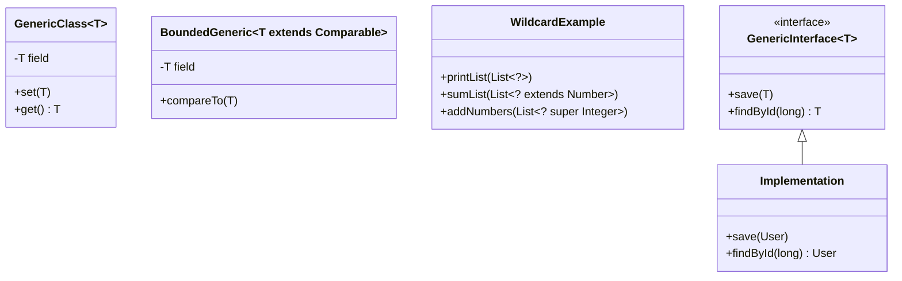

# Generics in Java

Learn how to create type-safe, reusable code using Java generics.

## Goal
The goal of this section is to understand Java generics, including generic classes, methods, interfaces, bounded type parameters, wildcards, and their benefits for type safety and code reusability.

## Explanation
Generics enable types (classes and interfaces) to be parameters when defining classes, interfaces, and methods. This provides stronger type checking at compile time and eliminates the need for explicit type casting.

### Key Concepts
*   **Type Safety:** Prevents ClassCastException at runtime
*   **Code Reusability:** Write code that works with different types
*   **Type Parameters:** Placeholder types (T, E, K, V, etc.)
*   **Generic Classes:** Classes with type parameters
*   **Generic Methods:** Methods with their own type parameters
*   **Bounded Type Parameters:** Restrict types to specific classes or interfaces
*   **Wildcards:** Unknown types represented by ?

### Common Type Parameters
*   **T** - Type
*   **E** - Element (used in collections)
*   **K** - Key
*   **V** - Value
*   **N** - Number
*   **S, U, V** - Multiple type parameters

### Benefits
*   **Type Safety:** Catches errors at compile time
*   **Elimination of Casts:** No need for explicit type casting
*   **Code Reusability:** Write once, use with multiple types
*   **Better Performance:** No boxing/unboxing for primitive types

## Code
Here is an example that demonstrates generics in Java:

```java
import java.util.*;

public class GenericsExample {
    
    // Generic class with single type parameter
    static class Box<T> {
        private T content;
        
        public void setContent(T content) {
            this.content = content;
        }
        
        public T getContent() {
            return content;
        }
        
        public boolean isEmpty() {
            return content == null;
        }
    }
    
    // Generic class with multiple type parameters
    static class Pair<K, V> {
        private K key;
        private V value;
        
        public Pair(K key, V value) {
            this.key = key;
            this.value = value;
        }
        
        public K getKey() {
            return key;
        }
        
        public V getValue() {
            return value;
        }
        
        public void setKey(K key) {
            this.key = key;
        }
        
        public void setValue(V value) {
            this.value = value;
        }
        
        @Override
        public String toString() {
            return "Pair{" + key + "=" + value + "}";
        }
    }
    
    // Generic method
    public static <T> void printArray(T[] array) {
        System.out.print("Array contents: ");
        for (T element : array) {
            System.out.print(element + " ");
        }
        System.out.println();
    }
    
    // Generic method with bounded type parameter
    public static <T extends Comparable<T>> T findMax(T[] array) {
        if (array == null || array.length == 0) {
            return null;
        }
        
        T max = array[0];
        for (int i = 1; i < array.length; i++) {
            if (array[i].compareTo(max) > 0) {
                max = array[i];
            }
        }
        return max;
    }
    
    // Generic method with multiple bounds
    public static <T extends Comparable<T> & Serializable> void processData(T data) {
        System.out.println("Processing data: " + data);
    }
    
    // Generic class with bounded type parameter
    static class NumberBox<T extends Number> {
        private T number;
        
        public NumberBox(T number) {
            this.number = number;
        }
        
        public T getNumber() {
            return number;
        }
        
        public double getDoubleValue() {
            return number.doubleValue();
        }
        
        public int getIntValue() {
            return number.intValue();
        }
    }
    
    // Wildcard examples
    public static void printList(List<?> list) {
        System.out.print("List contents: ");
        for (Object element : list) {
            System.out.print(element + " ");
        }
        System.out.println();
    }
    
    // Upper bounded wildcard
    public static double sumOfList(List<? extends Number> list) {
        double sum = 0.0;
        for (Number number : list) {
            sum += number.doubleValue();
        }
        return sum;
    }
    
    // Lower bounded wildcard
    public static void addNumbers(List<? super Integer> list) {
        for (int i = 1; i <= 5; i++) {
            list.add(i);
        }
    }
    
    // Generic interface
    interface Repository<T> {
        void save(T entity);
        T findById(long id);
        List<T> findAll();
        void delete(T entity);
    }
    
    // Implementation of generic interface
    static class UserRepository implements Repository<User> {
        private Map<Long, User> users = new HashMap<>();
        private long nextId = 1;
        
        @Override
        public void save(User user) {
            if (user.getId() == 0) {
                user.setId(nextId++);
            }
            users.put(user.getId(), user);
        }
        
        @Override
        public User findById(long id) {
            return users.get(id);
        }
        
        @Override
        public List<User> findAll() {
            return new ArrayList<>(users.values());
        }
        
        @Override
        public void delete(User user) {
            users.remove(user.getId());
        }
    }
    
    // Sample User class
    static class User {
        private long id;
        private String name;
        private String email;
        
        public User(String name, String email) {
            this.name = name;
            this.email = email;
        }
        
        // Getters and setters
        public long getId() { return id; }
        public void setId(long id) { this.id = id; }
        public String getName() { return name; }
        public void setName(String name) { this.name = name; }
        public String getEmail() { return email; }
        public void setEmail(String email) { this.email = email; }
        
        @Override
        public String toString() {
            return "User{id=" + id + ", name='" + name + "', email='" + email + "'}";
        }
    }
    
    // Generic utility class
    static class ArrayUtils {
        public static <T> List<T> toList(T[] array) {
            return Arrays.asList(array);
        }
        
        public static <T> T[] copyOf(T[] original) {
            return Arrays.copyOf(original, original.length);
        }
        
        public static <T> boolean contains(T[] array, T element) {
            for (T item : array) {
                if (Objects.equals(item, element)) {
                    return true;
                }
            }
            return false;
        }
    }
    
    // Type erasure demonstration
    public static void typeErasureDemo() {
        System.out.println("=== Type Erasure Demonstration ===");
        
        List<String> stringList = new ArrayList<>();
        List<Integer> integerList = new ArrayList<>();
        
        System.out.println("stringList class: " + stringList.getClass());
        System.out.println("integerList class: " + integerList.getClass());
        System.out.println("Are they the same class? " + (stringList.getClass() == integerList.getClass()));
        
        // Both are ArrayList at runtime - generics are erased
    }
    
    // Generic method with varargs
    @SafeVarargs
    public static <T> List<T> asList(T... elements) {
        return Arrays.asList(elements);
    }
    
    // Main method
    public static void main(String[] args) {
        // Basic generic class usage
        System.out.println("=== Basic Generic Class ===");
        Box<String> stringBox = new Box<>();
        stringBox.setContent("Hello Generics!");
        System.out.println("String box content: " + stringBox.getContent());
        
        Box<Integer> integerBox = new Box<>();
        integerBox.setContent(42);
        System.out.println("Integer box content: " + integerBox.getContent());
        
        // Multiple type parameters
        System.out.println("\n=== Multiple Type Parameters ===");
        Pair<String, Integer> pair = new Pair<>("Age", 25);
        System.out.println("Pair: " + pair);
        
        // Generic method usage
        System.out.println("\n=== Generic Methods ===");
        String[] stringArray = {"Apple", "Banana", "Cherry"};
        Integer[] integerArray = {1, 2, 3, 4, 5};
        
        printArray(stringArray);
        printArray(integerArray);
        
        // Bounded type parameters
        System.out.println("\n=== Bounded Type Parameters ===");
        String maxString = findMax(new String[]{"Apple", "Banana", "Cherry"});
        System.out.println("Max string: " + maxString);
        
        Integer maxInteger = findMax(new Integer[]{1, 5, 3, 9, 2});
        System.out.println("Max integer: " + maxInteger);
        
        // Number box
        System.out.println("\n=== Number Box ===");
        NumberBox<Double> doubleBox = new NumberBox<>(3.14);
        System.out.println("Double value: " + doubleBox.getDoubleValue());
        System.out.println("Int value: " + doubleBox.getIntValue());
        
        // Wildcards
        System.out.println("\n=== Wildcards ===");
        List<String> stringList = Arrays.asList("A", "B", "C");
        List<Integer> integerList = Arrays.asList(1, 2, 3);
        
        printList(stringList);
        printList(integerList);
        
        // Sum of numbers
        List<Double> doubleList = Arrays.asList(1.1, 2.2, 3.3);
        System.out.println("Sum of doubles: " + sumOfList(doubleList));
        System.out.println("Sum of integers: " + sumOfList(integerList));
        
        // Lower bounded wildcard
        List<Number> numberList = new ArrayList<>();
        addNumbers(numberList);
        System.out.println("Number list after adding: " + numberList);
        
        // Generic interface usage
        System.out.println("\n=== Generic Interface ===");
        UserRepository userRepo = new UserRepository();
        userRepo.save(new User("John Doe", "john@example.com"));
        userRepo.save(new User("Jane Smith", "jane@example.com"));
        
        System.out.println("All users: " + userRepo.findAll());
        System.out.println("User by ID: " + userRepo.findById(1L));
        
        // Utility methods
        System.out.println("\n=== Generic Utility Methods ===");
        String[] fruits = {"Apple", "Banana", "Orange"};
        List<String> fruitList = ArrayUtils.toList(fruits);
        System.out.println("Fruit list: " + fruitList);
        
        System.out.println("Contains 'Banana'? " + ArrayUtils.contains(fruits, "Banana"));
        System.out.println("Contains 'Grape'? " + ArrayUtils.contains(fruits, "Grape"));
        
        // Type erasure
        typeErasureDemo();
        
        // Varargs with generics
        System.out.println("\n=== Varargs with Generics ===");
        List<String> varargsList = asList("One", "Two", "Three");
        System.out.println("Varargs list: " + varargsList);
        
        // Raw types (avoid this)
        System.out.println("\n=== Raw Types (Avoid) ===");
        Box rawBox = new Box(); // Raw type - no type parameter
        rawBox.setContent("Hello");
        rawBox.setContent(123); // This compiles but is unsafe
        
        // This would cause ClassCastException at runtime
        // String content = (String) rawBox.getContent(); // Unsafe!
        
        System.out.println("\n=== Generics Best Practices ===");
        System.out.println("1. Use generics for type safety");
        System.out.println("2. Prefer specific types over wildcards when possible");
        System.out.println("3. Use bounded type parameters to restrict types");
        System.out.println("4. Avoid raw types");
        System.out.println("5. Use @SafeVarargs for varargs methods");
    }
}
```

## Diagrams


## Pitfalls
*   **Type Erasure:** Generics are erased at runtime, so you can't use instanceof with parameterized types
*   **Raw Types:** Using raw types defeats the purpose of generics and loses type safety
*   **Wildcard Confusion:** Not understanding when to use upper vs lower bounded wildcards
*   **Generic Arrays:** Cannot create arrays of parameterized types directly
*   **Overloading Issues:** Methods with same erasure cannot be overloaded
*   **Checked Collections:** Mixing generic and non-generic code can cause warnings

## Exercises/Examples
1.  **Create a generic `Stack<T>` class with push, pop, peek, and isEmpty methods.**
    <details>
    <summary>Answer</summary>

    ```java
    class Stack<T> {
        private List<T> elements = new ArrayList<>();
        
        public void push(T element) {
            elements.add(element);
        }
        
        public T pop() {
            if (isEmpty()) {
                throw new EmptyStackException();
            }
            return elements.remove(elements.size() - 1);
        }
        
        public T peek() {
            if (isEmpty()) {
                throw new EmptyStackException();
            }
            return elements.get(elements.size() - 1);
        }
        
        public boolean isEmpty() {
            return elements.isEmpty();
        }
    }
    ```
    </details>
2.  **Write a generic method that swaps two elements in an array.**
    <details>
    <summary>Answer</summary>

    ```java
    public static <T> void swap(T[] array, int i, int j) {
        if (i < 0 || i >= array.length || j < 0 || j >= array.length) {
            throw new IndexOutOfBoundsException();
        }
        T temp = array[i];
        array[i] = array[j];
        array[j] = temp;
    }
    ```
    </details>
3.  **When should you use `List<?>` vs `List<Object>`?**
    <details>
    <summary>Answer</summary>
    Use `List<?>` when you want to work with a list of unknown type but don't need to add elements to it. Use `List<Object>` when you specifically want a list that can hold any type of object and you might add elements to it.
    </details>

## References
*   [Oracle Generics Tutorial](https://docs.oracle.com/javase/tutorial/java/generics/index.html)
*   [Java Generics Documentation](https://docs.oracle.com/javase/8/docs/technotes/guides/language/generics.html)
*   [W3Schools Java Generics](https://www.w3schools.com/java/java_generics.asp)