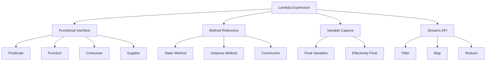

# Lambda Expressions in Java

Learn how to write concise, functional-style code using lambda expressions.

## Goal
The goal of this section is to understand Java lambda expressions, including their syntax, functional interfaces, method references, and how they enable functional programming paradigms in Java.

## Explanation
Lambda expressions provide a clear and concise way to represent one method interface (functional interface) using an expression. They enable you to treat functionality as a method argument, or code as data.

### Key Concepts
*   **Lambda Expression:** A block of code that can be passed around and executed later
*   **Functional Interface:** An interface with exactly one abstract method
*   **Method Reference:** A shorthand notation for lambda expressions that refer to existing methods
*   **Variable Capture:** Lambda expressions can access final or effectively final variables from their enclosing scope
*   **Type Inference:** The compiler can often infer parameter types

### Lambda Syntax
```java
(parameters) -> expression
(parameters) -> { statements; }
() -> expression
parameter -> expression
```

### Benefits
*   **Concise Code:** Reduces boilerplate code significantly
*   **Functional Programming:** Enables functional programming style
*   **Parallel Processing:** Works well with streams for parallel processing
*   **Improved Readability:** Makes code more readable and maintainable

## Code
Here is an example that demonstrates lambda expressions in Java:

```java
import java.util.*;
import java.util.function.*;
import java.util.stream.Collectors;

public class LambdaExpressionsExample {
    
    // Functional interfaces examples
    @FunctionalInterface
    interface Calculator {
        int calculate(int a, int b);
    }
    
    @FunctionalInterface
    interface StringProcessor {
        String process(String input);
    }
    
    @FunctionalInterface
    interface Validator<T> {
        boolean validate(T input);
    }
    
    // Person class for examples
    static class Person {
        private String name;
        private int age;
        private String city;
        private double salary;
        
        public Person(String name, int age, String city, double salary) {
            this.name = name;
            this.age = age;
            this.city = city;
            this.salary = salary;
        }
        
        // Getters
        public String getName() { return name; }
        public int getAge() { return age; }
        public String getCity() { return city; }
        public double getSalary() { return salary; }
        
        @Override
        public String toString() {
            return String.format("Person{name='%s', age=%d, city='%s', salary=%.2f}", 
                               name, age, city, salary);
        }
    }
    
    // Basic lambda expressions
    public static void basicLambdaExpressions() {
        System.out.println("=== Basic Lambda Expressions ===");
        
        // Traditional approach with anonymous inner class
        Runnable traditional = new Runnable() {
            @Override
            public void run() {
                System.out.println("Traditional approach");
            }
        };
        
        // Lambda expression equivalent
        Runnable lambda = () -> System.out.println("Lambda approach");
        
        // Execute both
        traditional.run();
        lambda.run();
        
        // Lambda with parameters
        Calculator addition = (a, b) -> a + b;
        Calculator subtraction = (a, b) -> a - b;
        Calculator multiplication = (a, b) -> a * b;
        
        System.out.println("Addition: " + addition.calculate(10, 5));
        System.out.println("Subtraction: " + subtraction.calculate(10, 5));
        System.out.println("Multiplication: " + multiplication.calculate(10, 5));
    }
    
    // Lambda expressions with collections
    public static void lambdaWithCollections() {
        System.out.println("\n=== Lambda with Collections ===");
        
        List<String> names = Arrays.asList("John", "Alice", "Bob", "Charlie", "David");
        
        // Traditional sorting
        Collections.sort(names, new Comparator<String>() {
            @Override
            public int compare(String a, String b) {
                return a.compareTo(b);
            }
        });
        System.out.println("Traditional sort: " + names);
        
        // Lambda sorting
        Collections.sort(names, (a, b) -> b.compareTo(a)); // Reverse order
        System.out.println("Lambda reverse sort: " + names);
        
        // Even simpler with method reference
        names.sort(String::compareToIgnoreCase);
        System.out.println("Method reference sort: " + names);
        
        // Iterating with lambda
        System.out.println("Iterating with lambda:");
        names.forEach(name -> System.out.println("Hello, " + name));
    }
    
    // Built-in functional interfaces
    public static void builtInFunctionalInterfaces() {
        System.out.println("\n=== Built-in Functional Interfaces ===");
        
        // Predicate - boolean test(T t)
        Predicate<Integer> isEven = n -> n % 2 == 0;
        Predicate<String> isLongString = s -> s.length() > 5;
        
        System.out.println("Is 10 even? " + isEven.test(10));
        System.out.println("Is 'Hello' long? " + isLongString.test("Hello"));
        
        // Function - R apply(T t)
        Function<String, Integer> stringLength = s -> s.length();
        Function<Integer, String> intToString = i -> "Number: " + i;
        
        System.out.println("Length of 'Java': " + stringLength.apply("Java"));
        System.out.println("Convert 42: " + intToString.apply(42));
        
        // Consumer - void accept(T t)
        Consumer<String> printer = s -> System.out.println("Printing: " + s);
        printer.accept("Lambda Consumer");
        
        // Supplier - T get()
        Supplier<Double> randomSupplier = () -> Math.random();
        System.out.println("Random number: " + randomSupplier.get());
        
        // UnaryOperator - T apply(T t)
        UnaryOperator<Integer> square = x -> x * x;
        System.out.println("Square of 7: " + square.apply(7));
        
        // BinaryOperator - T apply(T t1, T t2)
        BinaryOperator<Integer> max = (a, b) -> a > b ? a : b;
        System.out.println("Max of 10 and 15: " + max.apply(10, 15));
    }
    
    // Method references
    public static void methodReferences() {
        System.out.println("\n=== Method References ===");
        
        List<Person> people = Arrays.asList(
            new Person("John", 25, "New York", 50000),
            new Person("Alice", 30, "London", 60000),
            new Person("Bob", 35, "Paris", 55000)
        );
        
        // Static method reference
        people.forEach(Person::printPersonInfo);
        
        // Instance method reference
        StringProcessor processor = String::toUpperCase;
        System.out.println("Uppercase: " + processor.process("hello world"));
        
        // Constructor reference
        Supplier<Person> personSupplier = () -> new Person("Default", 0, "Unknown", 0);
        Person defaultPerson = personSupplier.get();
        System.out.println("Default person: " + defaultPerson);
        
        // Array constructor reference
        IntFunction<Person[]> arrayCreator = Person[]::new;
        Person[] personArray = arrayCreator.apply(5);
        System.out.println("Created array of length: " + personArray.length);
    }
    
    // Lambda expressions with streams
    public static void lambdaWithStreams() {
        System.out.println("\n=== Lambda with Streams ===");
        
        List<Person> people = Arrays.asList(
            new Person("John", 25, "New York", 50000),
            new Person("Alice", 30, "London", 60000),
            new Person("Bob", 35, "Paris", 55000),
            new Person("Charlie", 28, "New York", 70000),
            new Person("David", 32, "London", 65000)
        );
        
        // Filter and collect
        List<Person> newYorkPeople = people.stream()
            .filter(p -> p.getCity().equals("New York"))
            .collect(Collectors.toList());
        
        System.out.println("People from New York:");
        newYorkPeople.forEach(System.out::println);
        
        // Map operation
        List<String> names = people.stream()
            .map(Person::getName)
            .collect(Collectors.toList());
        
        System.out.println("Names: " + names);
        
        // Complex operations
        double averageSalary = people.stream()
            .filter(p -> p.getAge() > 30)
            .mapToDouble(Person::getSalary)
            .average()
            .orElse(0.0);
        
        System.out.println("Average salary for people over 30: " + averageSalary);
        
        // Grouping
        Map<String, List<Person>> peopleByCity = people.stream()
            .collect(Collectors.groupingBy(Person::getCity));
        
        System.out.println("People grouped by city:");
        peopleByCity.forEach((city, cityPeople) -> {
            System.out.println(city + ": " + cityPeople.size() + " people");
        });
    }
    
    // Variable capture
    public static void variableCapture() {
        System.out.println("\n=== Variable Capture ===");
        
        // Effectively final variables
        final int multiplier = 3;
        int addend = 5; // Effectively final
        
        // Lambda can capture these variables
        IntUnaryOperator operation = x -> x * multiplier + addend;
        
        System.out.println("Operation result: " + operation.applyAsInt(10));
        
        // Cannot modify captured variables
        // addend = 10; // This would cause compilation error
        
        // Instance variable capture
        VariableCaptureExample example = new VariableCaptureExample();
        example.demonstrateCapture();
    }
    
    // Advanced lambda patterns
    public static void advancedLambdaPatterns() {
        System.out.println("\n=== Advanced Lambda Patterns ===");
        
        // Composing predicates
        Predicate<Integer> isEven = n -> n % 2 == 0;
        Predicate<Integer> isPositive = n -> n > 0;
        Predicate<Integer> isEvenAndPositive = isEven.and(isPositive);
        
        System.out.println("Is 4 even and positive? " + isEvenAndPositive.test(4));
        System.out.println("Is -2 even and positive? " + isEvenAndPositive.test(-2));
        
        // Chaining functions
        Function<String, String> removeSpaces = s -> s.replace(" ", "");
        Function<String, String> toUpperCase = String::toUpperCase;
        Function<String, String> processString = removeSpaces.andThen(toUpperCase);
        
        System.out.println("Processed string: " + processString.apply("hello world"));
        
        // Custom functional interface with default methods
        Calculator enhancedCalc = (a, b) -> a + b;
        System.out.println("Sum: " + enhancedCalc.calculate(5, 3));
        
        // Using default method
        System.out.println("Product: " + enhancedCalc.multiply(5, 3));
    }
    
    // Performance considerations
    public static void performanceComparison() {
        System.out.println("\n=== Performance Comparison ===");
        
        List<Integer> numbers = new ArrayList<>();
        for (int i = 0; i < 1000000; i++) {
            numbers.add(i);
        }
        
        // Traditional loop
        long startTime = System.nanoTime();
        int sum1 = 0;
        for (Integer num : numbers) {
            if (num % 2 == 0) {
                sum1 += num;
            }
        }
        long traditionalTime = System.nanoTime() - startTime;
        
        // Lambda with stream
        startTime = System.nanoTime();
        int sum2 = numbers.stream()
            .filter(n -> n % 2 == 0)
            .mapToInt(Integer::intValue)
            .sum();
        long lambdaTime = System.nanoTime() - startTime;
        
        System.out.println("Traditional approach: " + traditionalTime + " ns");
        System.out.println("Lambda approach: " + lambdaTime + " ns");
        System.out.println("Results equal? " + (sum1 == sum2));
    }
    
    // Helper method for method reference
    public static void printPersonInfo(Person person) {
        System.out.println("Person: " + person.getName() + " (Age: " + person.getAge() + ")");
    }
    
    // Main method
    public static void main(String[] args) {
        basicLambdaExpressions();
        lambdaWithCollections();
        builtInFunctionalInterfaces();
        methodReferences();
        lambdaWithStreams();
        variableCapture();
        advancedLambdaPatterns();
        performanceComparison();
        
        System.out.println("\n=== Lambda Best Practices ===");
        System.out.println("1. Keep lambda expressions short and focused");
        System.out.println("2. Use meaningful parameter names");
        System.out.println("3. Prefer method references when possible");
        System.out.println("4. Be careful with variable capture");
        System.out.println("5. Use appropriate functional interfaces");
        System.out.println("6. Consider readability vs conciseness");
    }
}

// Helper class for variable capture demonstration
class VariableCaptureExample {
    private int instanceVar = 10;
    
    public void demonstrateCapture() {
        int localVar = 20;
        
        // Lambda can access both instance and local variables
        IntSupplier supplier = () -> instanceVar + localVar;
        
        System.out.println("Captured variables sum: " + supplier.getAsInt());
        
        // Can modify instance variable
        instanceVar = 30;
        System.out.println("After modifying instance var: " + supplier.getAsInt());
    }
}

// Enhanced functional interface with default methods
interface Calculator {
    int calculate(int a, int b);
    
    default int multiply(int a, int b) {
        return a * b;
    }
    
    default int divide(int a, int b) {
        return b != 0 ? a / b : 0;
    }
}
```

## Diagrams


## Pitfalls
*   **Variable Capture:** Cannot modify captured variables
*   **Return Type Inference:** Complex expressions may need explicit return types
*   **Exception Handling:** Checked exceptions require careful handling
*   **Performance:** Not always faster than traditional loops for simple operations
*   **Debugging:** Can be harder to debug than traditional code
*   **Overuse:** Don't use lambdas for complex logic that would be clearer in a method

## Exercises/Examples
1.  **Create a lambda expression that filters a list of strings to only include those longer than 3 characters.**
    <details>
    <summary>Answer</summary>

    ```java
    List<String> strings = Arrays.asList("Hi", "Hello", "Hey", "World");
    List<String> filtered = strings.stream()
        .filter(s -> s.length() > 3)
        .collect(Collectors.toList());
    ```
    </details>
2.  **Write a method that uses a lambda to sort a list of Person objects by age in descending order.**
    <details>
    <summary>Answer</summary>

    ```java
    public static void sortByAgeDescending(List<Person> people) {
        people.sort((p1, p2) -> Integer.compare(p2.getAge(), p1.getAge()));
        // Or using method reference:
        // people.sort(Comparator.comparingInt(Person::getAge).reversed());
    }
    ```
    </details>
3.  **When should you use a method reference instead of a lambda expression?**
    <details>
    <summary>Answer</summary>
    Use method references when the lambda expression simply calls an existing method. Method references are more concise and readable in such cases. Use lambda expressions when you need to perform more complex operations that can't be expressed as a simple method call.
    </details>

## References
*   [Oracle Lambda Expressions Tutorial](https://docs.oracle.com/javase/tutorial/java/javaOO/lambdaexpressions.html)
*   [Java 8 Lambda Expressions](https://www.oracle.com/java/technologies/lambda-expressions.html)
*   [W3Schools Java Lambda](https://www.w3schools.com/java/java_lambda.asp)